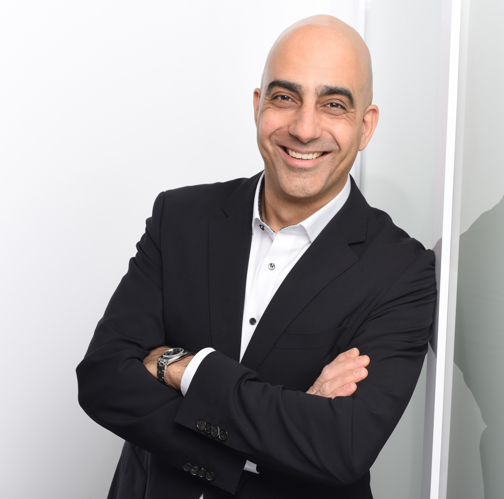

## Hi there 👋
<!--

-->

I'm Babak Banijamali. An Agile/Scrum experienced Project Manager and Product enthusiast. I have a technical background in software development, and most recently in digitization of energy projects. 

🔭 I’m currently working on a stealth startup in education and AI

🌱 I’m currently learning Full Stack Web Development & Data Science/Analytics from first principles. Part review, part deeper learning so I can apply it to my startup. 

👯 I’m looking to collaborate on digital literacy education for all

😄 Pronouns: he/him

📫 How to reach me: [LinkedIn](https://www.linkedin.com/in/babakbani/)

<!--
**babakbani/babakbani** is a ✨ _special_ ✨ repository because its `README.md` (this file) appears on your GitHub profile.

Here are some ideas to get you started:

- 🔭 I’m currently working on ...
- 🌱 I’m currently learning ...
- 👯 I’m looking to collaborate on ...
- 🤔 I’m looking for help with ...
- 💬 Ask me about ...
- 📫 How to reach me: ...
- 😄 Pronouns: ...
- ⚡ Fun fact: ...
-->
